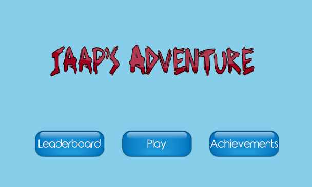
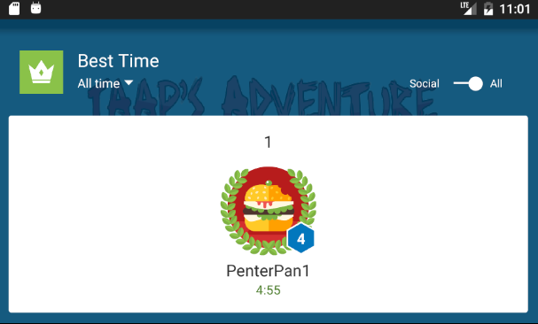
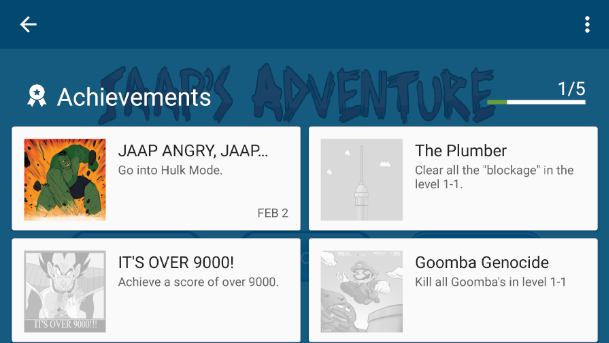
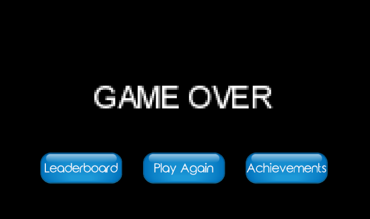

# **Jaap's Adventure**

*Copyright (c) 2017 Fjodor van Rijsselberg*

## Problem

This app will function as an easy way of relieving stress and easing boredom.
The user will play as Jaap controlling him and moving him across the screen towards the goal,
trying to get there as fast as possible, or gaining as high a score as possible.

## Screenshots

### Main Menu

### Leaderboard

### Achievements

### Game Over

## Features

Features of this application will be a start screen and the game interface itself.
The game interface will contain obstacles and a sprite, the user can move the sprite and the screen will follow throughout the level.
Possible additions to the application will be discussed at the end of the document.

## Sources

The app was build using the LibGDX Java game development framework made by Badlogic Games.
The levels, using sprites and tiles, were created using Tiled.
The app also uses Tiled to make specific tiles into object for collision purposes.
Authentication and the Leaderboard are done using Google Play Developer Console.

## Separation of Concerns

All the game related code is in the core part of the app, created using libGDX.
Only the AndroidLauncher and the game's assets are in the android part of the app.

In core the app will be using a package called scenes for all the classes that contain the labels placed over the game's interface.
Core will also contain a package called screens which will contain the different playscreen classes for different levels.
The last package, sprites, will contain the classes concerning the player's sprite, enemies and items.
Finally core will contain a class that will extend the game, which will be used to create, render and dispose of the screens used.

The android part of the app will contain a package for classes dealing with the Firebase authentication.
It will also contain a class displaying the start screen.

## Application Programming Interface

The Google Play Services API is used to implement the Leaderboard
## Problems

A problem that might arise is the lack of tilesets and sprites.
Although I have already founded a great set of tiles, I noticed there is a lack of high quality tilesets and sprites.
This doesn't mean they don't exist or aren't there, it will just be hard to find a very specific style, if I ever wanted to switch or expand.

Secondly while LibGDX does take care of all the low-level details, it takes time and practice to understand its documentation, making it harder to estimate the amount of time necessary to complete certain aspects of the project. Luckily there is a multitude of tutorials on the subject on the internet, which will help solving this problem.

## Minimum Viable Product

The basis of this application will be a start screen and a working first level; playable and bugless.
Expansion of the app would focus on more levels, different difficulties, a high score database and authentication.
If the first level is working and playable, the next implementations would be the authentication and scoreboard.
After that the focus would be on creating more levels to play and creating multiple ways to play a level.

*Made by Fjodor van Rijsselberg*
