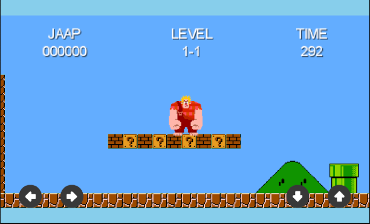

# Report

## Description
In this game you play as Jaap as you try to free him from the game he was trapped in.
The levels can be solved as fast as possible, with the highest score, or just for fun.
You can check out how well you did compared to your friends or the whole world on the leaderboard.
There are also achievements you can get through out the game, and an achievement interface to check which achievement you got or still need to get.

## Technical Design

### Main Parts
The application has two seperate parts: the android and the core.
This is done when you setup a project using LibGDX, so that you can easily design code that can be used for multiple platforms.
Almost all the application's code is therefore in the core, the android part only contains the assets, values, and the AndroidLauncher class.

### Android
AndroidLauncher initializes the main game class Seeker and defines the methods used in the PlayServices interface.
In assets we have the images used for the controller, the textures and pack used for all the sprites, the music and soundeffects and finally a skin used for the button design.
Values contains ids.xml, which hold the unique ID's for the achievements and leaderboards that are used in AndroidLauncher.

### Main Game Class
In the core part of the application we start at the Seeker class.
This is the class that holds the static BITS used for collision detection throughout the rest of the code.
It is also the only place where we make a SpriteBatch, because this is very resource heavy.
The batch is used in all screens that require sprite textures in the application.
We also load in the music used in the game into the AssetManager and finally set the first screen, the Main Menu.

### Screens
In the screen package we start with Main Menu. Main Menu can show the Leaderboard or Achievement page using the methods in PlayServices, and can set the game to the PlayScreen.
In the PlayScreen all the textures and sprites are loaded in, updated and rendered. it follows the main sprite and handles all input that controls the sprite's movement. It also handles the calls to other screens in situations that the game is won or lost.
The screens that display when this happens simply let you replay, return to Main Menu or show the Leaderboard.

### Tools
In the tools package we start with the B2WorldCreator which creates all the objects made in Tiled. for every object layer made in Tiled a body and fixture is created. The object is also assigned a BIT for collision purposes.
the Controller class creates button images and inputlisteners to check if a button is pressed, which we can then use in the PlayScreen to move our sprite. It uses tables and a stage to show the buttons on the PlayScreen.
The WorldContactListener is called when two objects come in to contact. It uses the BITS assigned to the objects to decide what happens when they come into contact. It is also used to implement what happens when to objects end their contact.

### Sprites
All sprites have a body created in the world and a fixture attached to that body which is assigned either a texture or an animation.
A sprite can only have a single texture or a whole scala of animations and textures depending on its fucntion and uses. When the body is created it is also assigned a position, but this can be overwritten in another method if neccessary. The fixture has a specific and size and assigns the sprites BIT and which BITS the sprite can collide with. One sprite can have multiple fixtures with different purposes. For example to detect if Jaap has hit something with his head there is a specific fixture at his heads location. This fixture has its own BIT and will therefore execute a method that only happens when Jaap hits certain things with his head.

#### Enemies
The sprites package contains three different packages, starting with the enemies sprite package.
All enemies use the abstract class Enemy as a base for their structure, to make it easier to add new enemies.
The Goomba and Turtle class both make a specific enemy that can be added as an object in Tiled and will then be created at that position by the B2WorldCreator class. They use the methods of their abstract class, but specific to their function and design.

#### Tile Objects
in the tileobjects we have all our tiles that have unique interaction with the player, instead of being just a static body with which the player can collide. We start off again with a abstract class; InteractiveTileObject is the base for all tiles that have different interactions. Brick, CoinBlock and EndBlock all extend InteractiveTileObject and have their own BIT and onHeadHit method.

#### Items
Items also has an abstract class, in this case called Item, that sets the basics for what an item should have. Items also have an ItemDef that is used to decide the position and type of an item when it is spawned. This spawning is done in PlayScreen and makes sure the correct item is spawned at the correct position. Coin and Hulkifier are the two items in the game right now. Where hulkifier has its own velocity, coin does not. Hulkifier also hulks out Jaap when it is used, but more on that in the Jaap section.

#### Jaap
The sprite the player controls is called Jaap, which is by far the most complex sprite. Multiple states are used to get the correct animation or texture frames, which are then set in update. Jaap can also change into his Hulk Mode; In this mode Jaap turns green and has increased strength. All these changes are implemented by redefining Jaap as Hulk and changing the textures and animations frames used. the Jaap class also contains what happens to the game when Jaap wins or dies and updates this in the PlayScreen, which implements the correct response.

### PlayServices
The PlayService Interface holds all the methods we need to use the Google Play Services. This way we can call to these methods outside ot the android part of our application. We are now able to call to our Leaderboard and Achievements even outside of the android part of our application.

## Development Challenges
The guide I started off with used Super Mario Bros as an example to implement the basics needed to make a game. One of the reason this was very convenient was the easily available tilesheets and sprites. The dificulty came when I tried to make the game more unique and stray away from the Mario style. Finding aestethicly good looking textures for the tiles was difficult and implementing a different kind of sprite would take alot time. Not only do you have to find a spritesheet, you also have to find the texture regions and implement them in your players movements. In the end I decided to keep the tile style used in Mario mostly because of personal preference. There were other options I tried, but none had the same feel that I was looking to use in my game. I did find a different sprite, and with it a direction to take the story of my game in. The Jaap sprite keeps in check with the game's 8-bit design and has a texturesheet with enough textures to use for things like running, jumping and even smashing animations. Although I did implement gameplay different from the original Mario, I had even more ideas for Jaap that I did not have the time for to add to the game.

One of these additions was a viking axe that Jaap could throw to kill enemies. The implemention was succesful, but too buggy to get working consistenly, which made me decide to scrap the whole concept from the game.

When trying to implement my Leaderboard and Achievements I used the Google Play Developer Console. This required to give Google my own unique SHA-1 key, which took a lot of effort to obtain, not just for release, but also for debug version.

The Leaderboard and Achievement required the Google Play Services library, but the newest version of this library was not compatible with Google API's above 23 for the emulator. Finding this problem and a solution took quite some time and effort.

## Decision Making
As said in the Development Challenges section, there were alot of things I would have like to add to the game. Instead of implementing this new things I decided to improve the functionality of the things already in the application, to decrease the amount of inconsistencies and make the game as smooth to play as possible. The design I used for my code is made in a way that allows for easy additions to things like blocks, enemies and items. This means that adding new features is easily done and does not effect the rest of the application. The maps and objects used can be easily changed in Tiled, which means that level design can be done extremely fast and requires no extra coding unless you want to add a new unique object with its own interactions. The Leaderboard and Achievements are made possible by the Google Play Developer Console. This was done not only because creating an online leaderboard and achievements list would have taken up a huge amount of time, it also means that it will log you in automaticly if you already have a google account.

I decided to keep the screens besides the PlayScreen simple and clear. Game applications for smartphones have alot of flashing colors and bubbly graphics. I don't very much enjoy this style and think that a simple interface with clear choices is easier on the eye. The reason I created a seperate Game Over and Game Won screen, although they are similar to the Main Menu, is to make the user feel the impact of eiter death or victory. These screens are also kept simple to keep the focus on the actual game, and away from other screens. 

